# Hi, I'm Youssef 👋

Full-stack developer passionate about building scalable web applications and exploring system-level programming.

## 🛠️ Tech Stack

**Languages**

**Frontend**

**Backend**

**Databases & Tools**

**Currently Exploring**

## 📊 GitHub Stats

  

## 🤝 Connect With Me

  

